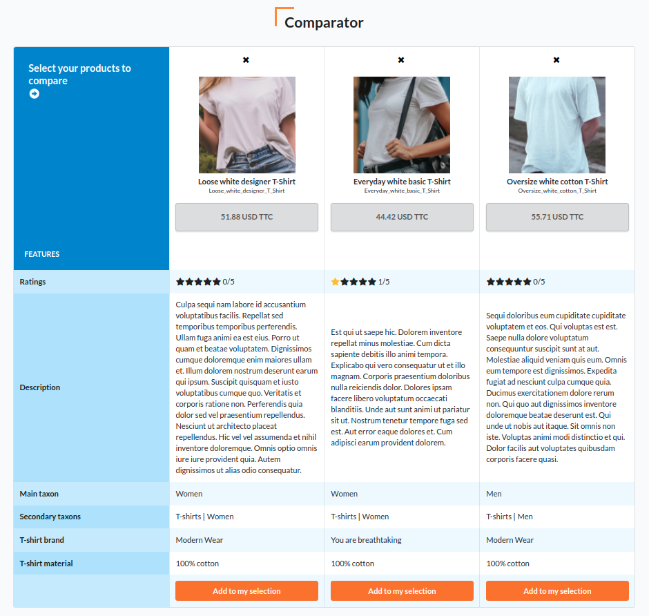

<p align="center">
    
</p>

<h1 align="center">Asdoria Product Comparator Plugin</h1>

<p align="center">Compare different products with each other</p>

<p align="center">
    
</p>

## Installation

---
1. Add the repository to composer.json

```JSON
"repositories": [
    {
        "type": "git",
        "url": "https://github.com/asdoria/AsdoriaSyliusProductComparatorPlugin.git"
    }
],
```
2. run `composer require asdoria/sylius-product-comparator-plugin`


3. Add the bundle in `config/bundles.php`

```PHP
Asdoria\SyliusProductComparatorPlugin\AsdoriaSyliusProductComparatorPlugin::class => ['all' => true],
```

4. Import config and enabled sylius_api in `config/packages/_sylius.yaml`
```yaml
imports:
    - { resource: "@AsdoriaSyliusProductComparatorPlugin/Resources/config/app/config.yaml"}

[...]

sylius_api:
    enabled: true
```

5. Add comparator javascript and bazingajstranslation script in your layout scripts
```html

    {{ sylius_template_event('sylius.shop.layout.javascripts') }}
    {{ sylius_template_event('asdoria.shop.product_comparator.javascripts') }}

    <script src="{{ asset('bundles/bazingajstranslation/js/translator.min.js') }}"></script>
    <script src="{{ url('bazinga_jstranslation_js', {locales: 'en,fr'}) }}"></script>

```

6. Add comparator stylesheet in your layout stylesheets
```twig

    
        {{ sylius_template_event('sylius.shop.layout.stylesheets') }}
    
    {{ sylius_template_event('asdoria.shop.product_comparator.stylesheets') }}

```

7. Add `data-locale` attribute to your layout `<body>`
```html
<body class="pushable" data-locale="{{ app.request.locale }}">
```

8. Expose sylius_api in `config/routes/sylius_api.yaml`
```yaml
sylius_api:
    [...]
    options:
        expose: true
```

9. In `config/routes/sylius_shop.yaml`:
   1. Add comparator route
    ```yaml
    asdoria_product_comparator:
        resource: "@AsdoriaSyliusProductComparatorPlugin/Resources/config/routing.yaml"
    ```
    2. Expose `sylius_shop_product_index`
   ```yaml
   sylius_shop_product_index:
    path: /{_locale}/taxons/{slug}
    methods: [GET]
    defaults:
        _controller: sylius.controller.product:indexAction
        _sylius:
            template: "@SyliusShop/Product/index.html.twig"
            grid: asdoria_shop_product
    requirements:
        slug: .+
        _locale: ^[A-Za-z]{2,4}(_([A-Za-z]{4}|[0-9]{3}))?(_([A-Za-z]{2}|[0-9]{3}))?$
    options:
        expose: true
   ```

### Styles

Add global `tailwind` in `config/packages/twig.yaml`:
```yaml
twig:
    [...]
    globals:
        tailwind: true
```
To switch between Semantic UI and Tailwind CSS, change the value of this variable

## Usage

1. Include `src/Resources/views/Comparator/_addToComparator.html.twig` with product
2. Include `src/Resources/views/Comparator/_fixedButton.html.twig` on the pages you want
3. See result at `http://your-shop/locale/comparator`
